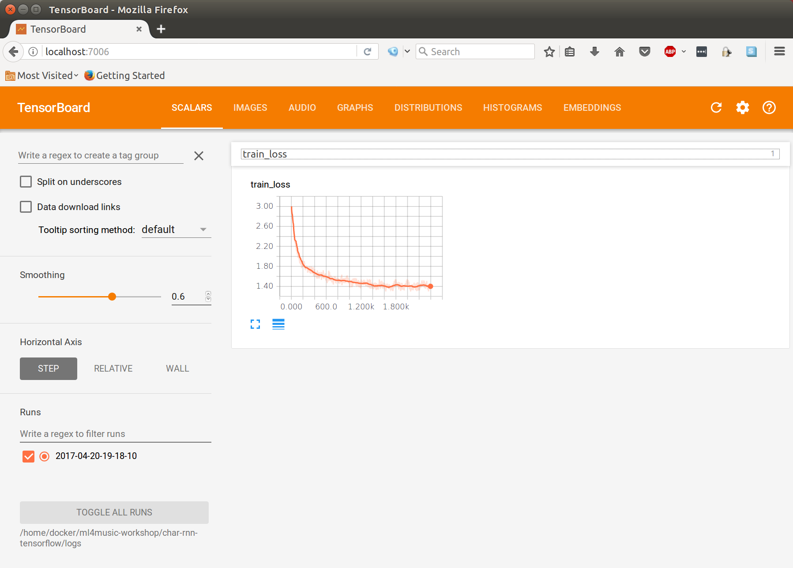

# ml4music-workshop
Machine Learning for Music, Audio, and Sound Synthesis workshop @ the School of the Art Institute of Chicago, April 23rd, 2017.

## Overview

In this workshop we will learn about and use generative machine learning models to create new musical experiments. Generative models learn patterns from example data, and once trained, can be used to create new content similar to the data they were trained on. We will go through this full pipeline, from training, to generating, using three different models, each in a different music/audio domain:

- Song lyric generation (using a tensorflow implementation of [char-rnn](https://github.com/sherjilozair/char-rnn-tensorflow/tree/5029173fc6ad527545082abcaf6c267061825484))
- Symbolic music generation (think MIDI, or sheet music) (using [midi-rnn](https://github.com/brannondorsey/midi-rnn/tree/cf6d1b6ceca80fe3fcf978b3a273fba6fceaed41))
- Raw audio generation (actual audio files, .wav and .mp3, etc...) (using a tensorflow implementation of [WaveNet](https://github.com/ibab/tensorflow-wavenet/tree/6e0b27d6c934d6beca0c4b3c2972c21bd86f5499))

We will begin by training a basic Recurrent Neural Network (RNN) on a corpus (large text dataset) of lyrics from thousands of pop songs. Next, we will use a similar model to generate new MIDI tracks in the style of ~100 MIDI files that we will train it with. Finally, we will dable in brand-new research into generating raw audio files at the sample level!

## Getting Started

We are going to be using a different tool for each of the three 1) text, 2) music, and 3) sound experiments. I've done my best to choose/build tools for each of these domains that are very similar to one another, to help flatten the learning curve. Once we develope an understanding for the first tool, char-rnn, you will find that the others are very similar.

I've created a Docker image that has everything needed to train our generative models pre-installed. If you would prefer not to use Docker, and instead install the dependencies yourself, see the manual installation instructions at the bottom of this README.

### Downloading this Repository

First, lets get you a copy of this here code. There should be a "Clone or Download" button on the right side of this page. Click that select "Download ZIP". Unzip :)

If you are comfortable using git, you can instead clown this repo with:

```
git clone https://github.com/brannondorsey/ml4music-workshop.git
```

### Installing with Docker

Next, download and install Docker CE (Community Edition) for your platform: [MacOS](https://download.docker.com/mac/stable/Docker.dmg) | [Windows](https://download.docker.com/win/stable/InstallDocker.msi) | [Linux](https://docs.docker.com/engine/installation/). Once unzipped, open the downloaded Docker app and follow the on-screen instructions. If you have an issue installing Docker on your computer, see the [Docker installation page](https://docs.docker.com/engine/installation/) for more info.

Once you've got docker installed, lets make sure it is working properly. Open your Terminal application (on MacOS, type "terminal" into your application search bar) and run the following command (copy + past the below text, then press ENTER).

```bash
docker --version
```

If you see a version number that means everything has been installed correctly!

Inside this repository, I've included a helpful little script called `start.sh`. This script will automagically log us into the workshop's Docker container. To run it, you must navigate your Terminal to this repository's folder (the one you downloaded earlier).

```bash
# the "cd" command stands for "change directory". we use it to 
# navigate around our terminal, just like you normally navigate
# a filebrowser to view the files on your computer
cd /path/to/this/folder

# once we are in this repository's folder we can execute the
# start.sh script like so
./start.sh
```

The first time you run it it needs to download our Docker Image from the internet (~2GB), so this may take a while. Once complete, you should see the message:

```
Starting TensorBoard 41 on port 7006.
(You can navigate to http://172.17.0.2:7006)
``` 

That means everything worked great! Press ENTER. You will now find yourself logged into our docker container.

## Lyric generation with char-rnn

The first model that we will experiment with is a character-level recurrent neural network, or char-rnn. This model was first introduced by [Andrej Karpathy](https://cs.stanford.edu/people/karpathy/) in his now-well-known blog post [The Unreasonable Effectiveness of Recurrent Neural Networks](https://karpathy.github.io/2015/05/21/rnn-effectiveness/).

Given any text file, cha-rnn learns the patterns present in that file one character at a time. With enough quality data, the correct model hyperparameters (more on that soon), and enough training time, char-rnn can learn to generate new text that appears as if it has come from the same author of the training text. Implemented correctly, char-rnn does not memorize the text from the training file, but rather learns patterns from it and extrapolates from those patterns to create new words and sentences that are not present in the original training file.

The particular implementation of char-rnn that we will be using is called [char-rnn-tensorflow](https://github.com/sherjilozair/char-rnn-tensorflow). In the Machine Learning community, it is very common for a paper to be published, or a new method proposed, giving an algorithm or model architecture a certain name. Soon a handful of seperate implementations using different languages or frameworks appear with descriptive variations on that name.

We will begin using char-rnn by training an RNN model on a corpus of top 100s billboard lyrics from 1946-2015. For the remainder of this document, it will be assumed that we are executing commands inside of the Docker container we've attached to with `start.sh`.

```bash
# navigate to the char-rnn-tensorflow directory
cd char-rnn-tensorflow

# ls lists the names of the files in the
# directory you are currently located 
ls
```

Take particular note of two python scripts in `char-rnn-tensorflow`: `train.py` and `sample.py`. We will use `train.py` first script to train our model on a textfile of our choice. Once that is done, we can use `sample.py` to generate new text from our trained model.


We can run both of these scripts using python. First, lets take a look at the `train.py` usage screen:

```bash
# here we are using the "--help" command-line argument
# to print the train.py usage screen
python train.py --help
```

This gives us a list of command-line arguments that we can use to change the behavior of `train.py`. Command-line arguments follow the name of the script/program you are running when executing a command on the command-line. You can include as many of them as you wish and their order doesn't matter. Their general format looks like this:

```
# this is pseudocode, don't run this
program_name --argument_1 value_1 --argument_2 value_2 # etc...
```

In our case, we treat `python train.py` as our "program_name" and everything that follows is a command-line argument that we supply a value for. I will go over a few of the basic command-line arguments needed to train our network, but once you've got those down, or if you want to jump ahead, experiment with other arguments listed with `python train.py --help`.

### Training a char-rnn model

The most important command-line argument for `train.py` is `--data_dir`. This lets our program know where the data we would like to train the model with is located. This implementation of char-rnn requires each text file that we would like to train with to be named `input.txt`. The folder where this `input.txt` file is located will be passed to `--data_dir`. Lets begin by training a model using the lyrics from top 100s billboard songs. From inside the char-rnn-tensoflow directory run the following:

```bash
python train.py --data_dir ../data/lyrics/data/billboard_lyrics_1946-2015
```

After a brief moment, you should see continuous output that looks like this:

```
1/154000 (epoch 0), train_loss = 3.759, time/batch = 0.117
2/154000 (epoch 0), train_loss = 3.203, time/batch = 0.118
3/154000 (epoch 0), train_loss = 3.000, time/batch = 0.115
4/154000 (epoch 0), train_loss = 2.951, time/batch = 0.116
5/154000 (epoch 0), train_loss = 2.892, time/batch = 0.118
6/154000 (epoch 0), train_loss = 2.876, time/batch = 0.118
7/154000 (epoch 0), train_loss = 2.836, time/batch = 0.118
8/154000 (epoch 0), train_loss = 2.859, time/batch = 0.117
9/154000 (epoch 0), train_loss = 2.829, time/batch = 0.117
```

Congratulations! You are now training a char-rnn model on pop song lyrics. The time it takes to train Machine Learning models varies greatly, from a few seconds or minutes to hours and days. Leave your model training and we will take a peek at its training process in real-time using Tensorboard.

### Monitoring training progress with tensorboard

Tensorboard is an awesome tool that gives us a window through which to measure the metrics in our models as they train. To view char-rnn while it trains navigate your web browser to:

- <http://localhost:7006>

Click the "train_loss" panel to expand the graph.



This graph shows our model's training loss, aka error, over time. It shows the "incorrectness" of predicted letters at each iteration (step) of our training process, and so we would like to minimize this value. It is very common to see a training loss value that diminishes at an exponential rate, dropping rappidly at the beginning and then changing more slowly over time until it converges with little-to-no change for an extended number of training steps. It is usually once our model converges that we would like to stop training, as it will no longer improved, and could actually get worse.

Once it looks like your training loss has converged, head back to your docker container and kill the training process by pressing CTRL+C. The trained model checkpoints are saved in `save/` by default (you can change this location, as well as the frequency with which checkpoints are saved, with the `--save_dir` and `--save_every` arguments respectively). When we generate text using our model, we will load the trained weights from one of these checkpoint files.

### Generating text with a trained cha-rnn model

Now that we've trained our first model we are ready to generate new lyrics with `sample.py`. By default, `sample.py` will load checkpoints from `save/`.

```bash
python sample.py -n 10000 # number of characters to generate
```

You should see your generated text spit directly into the console. To instead save the generated lyrics to file, use a [bash redirect](https://en.wikipedia.org/wiki/Redirection_(computing)).

```bash
# save generated lyrics to the ../data folder so that we
# can access it on our host machine (see below) 
python sample.py -n 10000 > ../data/generated_lyrics.txt
```

When our docker container was created with `./start.sh`, the `data/` folder inside this repository was shared with the docker container's filesystem. That means that any file you edit/place in the `data/` folder will be made inside of the corresponding `data/` folder. This is great, because it means that we can add files to `data/` and then train using those files inside of docker. It also means that any file

`sample.py` has some useful command-line arguments that you can inspect by running it with the `--help` flag. The `--prime` and `--sample` arguments are perhaps the most notable. `--prime` argument allows you to set the "seed" text to be passed to the model at the beginning of generation. This causes the model to "finish the sentence":

```bash
python sample.py --prime "baby do you wanna"
``` 

`--sample` changes the way that characters are predicted by our model. By default, our model creates a probability distribution over all possible characters (our character vocabulary) based on the previous `n` input characters, called the "sliding window". The model then samples from that probability distribution to predict the next character in the sequence, and then adds that character to the input list and the process repeats. `sample.py` supports two alternative methods. The first is called greedy argmax, where rather than sampling from the probability distribution provided as the output from our model to select to predict the next character in the list, it simply chooses the character with the highest probability. In practice, this method falls into loops of producing the same character and words and doesn't perform particularly well. You can try out greedy argmax sampling yourself with:

```bash
# use greedy argmax sampling
python sample.py --sample 0 
```

Another sampling method supported is like a mixture of greedy argmax and the default per-character sampling. Using `--sample 2` samples on spaces instead of characters. This method usually produces results that are more readable/with fewer errors. This is recommended if the default sampling is producing nonsensical results.

```bash
# sample on spaces instead of characters
python sample.py --sample 2
```

### Using your own text

I've scraped the [Original Hip-Hop Lyrics Archive](http://ohhla.com/all.html) and concatenated lyrics from over 2,000 hip-hop tracks to `OHHLA/input.txt`. It is ripe for the trainin' on. Sample that sheit.

You can also (and totally should) find your own text to train on. If you are pulling from multiple sources/files, simply combine them all into one file called `input.txt` and save it to `data/YOURDATA/input.txt`. Then train on that data using (replacing `YOURDATA` with a custom name):

```bash
# point the model to your data and create a new directory to save checkpoints
# in to avoid clobbering your other checkpoints
python train.py --data_dir ../data/YOURDATA/input.txt --save_dir save_YOURDATA
```

Point your browser to <http://localhost:7006> to monitor training, and exit with CTRL+C once error has converged. Then generate new content with:

```bash
# load checkpoints from the directory you saved them to during training
python sample.py --save_dir save_YOURDATA
```

Char-rnn is a general purpose generative model and has uses far beyond our narrow task of employing it to generate song lyrics. Anything that can be represented by a text character can be learned and generated by char-rnn! Awesome examples of char-rnn being used for other domains include:

- [Clickbait advertisements](http://clickotron.com/) (great blog post)
- [Raw audio waveforms trained on a human voice](https://www.youtube.com/watch?v=NG-LATBZNBs)
